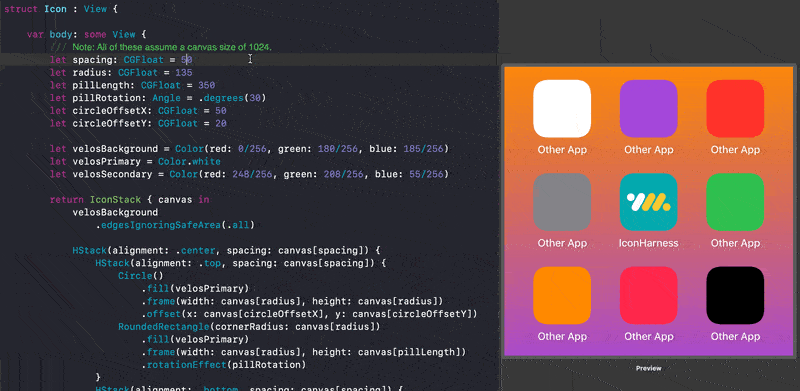
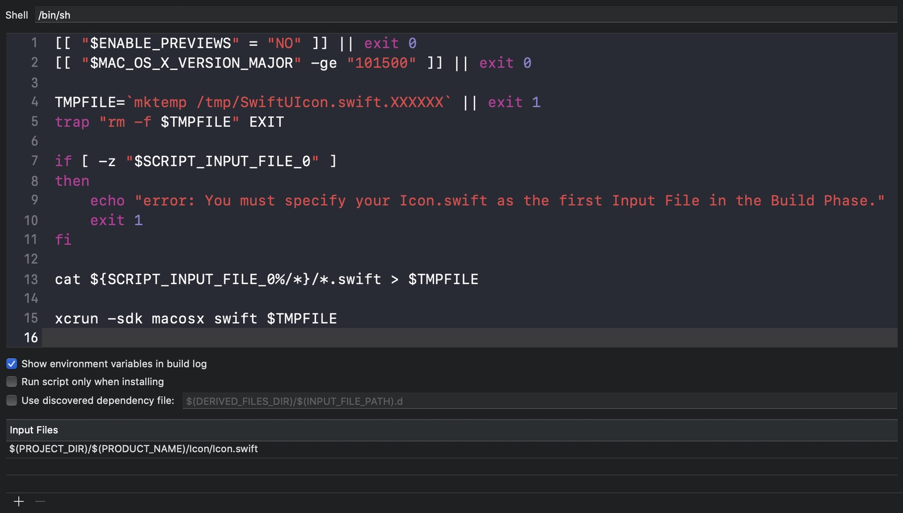

# SwiftUIcon

**SwiftUIIcon** is a set of scripts and helpers for creating your iOS or iPadOS app icon in SwiftUI using shape and path drawing primitives.

<p align="center">
  
</p>

## Getting Started

Adding this to your project is currently a manual process and requires 3 steps:

1. Add SwiftUIcon using Swift Package Manager
2. Add a Run Script build phase before your Copy Resources phase and specify the path to `Icon.swift` as the first Input File (probably `$(PROJECT_DIR)/$(PRODUCT_NAME)/Icon/Icon.swift`) and the Assets.xcassets as the output file (probably `$(PROJECT_DIR)/$(PRODUCT_NAME)/Assets.xcassets`):

```bash
cd "${BUILD_ROOT}"/../../SourcePackages/checkouts/SwiftUIcon
chmod +x build-script.sh
./build-script.sh
```
<p align="center">
  
</p>

## Adding Your Icon

You can now edit the contents of the `IconStack` wrapper helper view inside of `Icon.swift`. This is essentially a `ZStack` with a `.center` alignment that provides a proxy to relatively position elements based on an assumed 1024x1024 canvas size. See [Apple's SwiftUI Drawing Tutorial](https://developer.apple.com/tutorials/swiftui/drawing-paths-and-shapes) for more info on drawing using SwiftUI.

## Limitations

* It's a bit of a hack, but [Velos](https://velosmobile.com/) is currently using it in a project 👍
* Installing this is pretty manual. Some currently technical issues prevent making it a Swift Package, but feel free to file an issue if you find a better way!
* Because the View is rendered at all the individual sizes, anything that has a fixed size will not scale properly. To get around this, you should use the `CanvasProxy` passed into the function builder of `IconStack`. Any place where you would normally have a hard-coded `value`, you should use `canvas[value]`. You can also scale fonts and other elements manually with the `CanvasProxy.scale` property. As an example, `Text("Testing").font(Font.system(size: 200 * canvas.scale))` should get you a properly scaled `Text` element.
* Since the run script essentially concatenates all the Swift files and runs it as a macOS script, any elements you use in your Icon must look the same on both iOS and macOS. So you should probably stay away from actual UI controls 😉

## License
MIT

## Contact
* Email - zac@velosmobile.com
* Github - [@zac](https://github.com/zac) / [@velos](https://github.com/velos)
* Twitter - [@zacwhite](https://twitter.com/zacwhite) / [@velosmobile](https://twitter.com/velosmobile)
